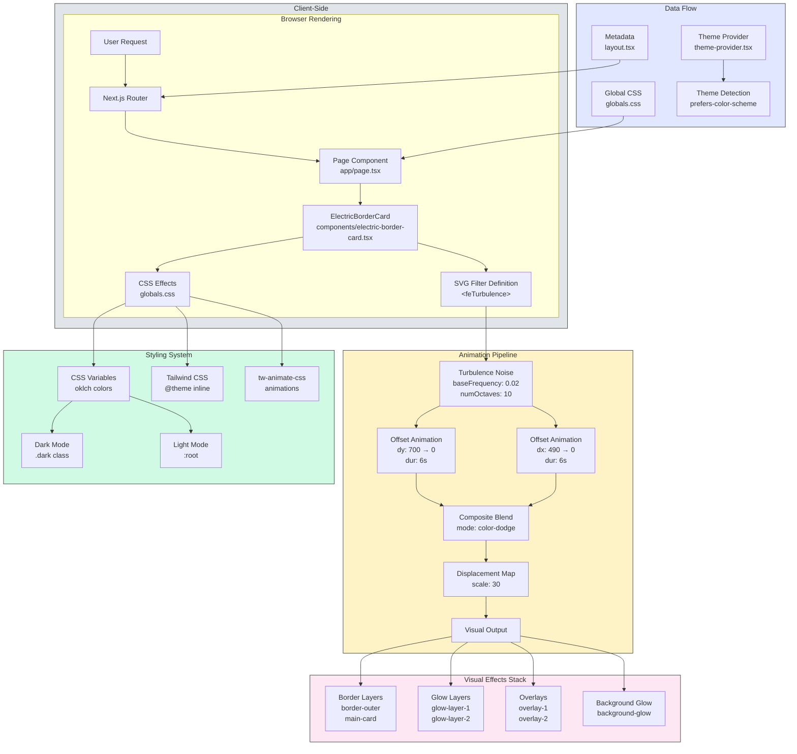

# Metallic Silver Border Card

> A visually stunning metallic silver border card component with animated electric effects, built with Next.js and Tailwind CSS.

[](https://vercel.com/gileb64375-5584s-projects/v0-metallic-silver-border-card)
[](https://v0.app/chat/projects/b3b3mxLk3k9)
[](https://nextjs.org/)
[](https://react.dev/)
[](https://www.typescriptlang.org/)
[](https://tailwindcss.com/)

---

## Overview

This project showcases a premium **metallic silver border card** component with a mesmerizing electric border animation effect. The card features a sophisticated glass-morphism design with animated SVG filters that create a dynamic, electrified silver border effect.

**Live Demo:** [https://vercel.com/gileb64375-5584s-projects/v0-metallic-silver-border-card](https://vercel.com/gileb64375-5584s-projects/v0-metallic-silver-border-card)

---

## Features

### Core Features

- **Animated Electric Border Effect** — Uses SVG `feTurbulence` and `feDisplacementMap` filters to create a dynamic, animated metallic border
- **Multi-layer Glow System** — Three distinct glow layers with varying blur intensities for depth
- **Glass Morphism Design** — Frosted glass-style badges with gradient overlays
- **Dark/Light Theme Support** — Full CSS variable-based theming with CSS custom properties
- **Responsive Design** — Adapts seamlessly to different screen sizes
- **Smooth Animations** — CSS and SVG-based animations running at 60fps
- **Premium Typography** — Modern, clean typography with proper hierarchy
- **Gradient Overlays** — Multiple overlay layers with blend modes for visual depth

### Visual Effects

- **SVG Turbulence Displacement** — Creates organic, electric-like distortion patterns
- **Dual Glow Layers** — Sharp and diffused glow effects around the card border
- **Background Glow** — Soft radial glow emanating from the card
- **Overlay Blend Modes** — `overlay`, `color-dodge` blend modes for premium look
- **Masked Divider** — Gradient-masked horizontal divider with transparency

### Design Highlights

- **Metallic Color Palette** — Uses `oklch` color space for perceptual accuracy:
  - `#c0c0c0` (Silver) — Primary border color
  - `#e8e8e8` (Silver Bright) — Glow highlight
  - `#808080` (Silver Dark) — Shadow depth
- **24px Border Radius** — Generous rounded corners for modern aesthetic
- **2px Border Width** — Precise border thickness for crisp appearance
- **Glass Badge Effect** — Radial gradient overlays with border masking

### Technical Highlights

- **Zero Runtime Dependencies** — Pure CSS/SVG animations, no animation libraries
- **CSS Custom Properties** — Full theming support via CSS variables
- **TypeScript Support** — Full type safety throughout
- **Shadcn/ui Compatible** — Uses standard shadcn/ui configuration and utilities
- **Next.js 15 App Router** — Modern React Server Components architecture

---

## System Architecture



---

## Tech Stack

### Core Technologies

| Technology | Version | Purpose |
|------------|---------|---------|
| **Next.js** | 15.2.4 | React framework with App Router |
| **React** | 19 | UI library with hooks |
| **TypeScript** | 5.x | Type-safe JavaScript |
| **Tailwind CSS** | 4.x | Utility-first CSS framework |

### UI & Styling

| Package | Version | Purpose |
|---------|---------|---------|
| **tailwindcss-animate** | 1.0.7 | Tailwind animation utilities |
| **tw-animate-css** | latest | CSS animation keyframes |
| **clsx** | 2.1.1 | Conditional class names |
| **tailwind-merge** | 2.5.5 | Tailwind class merging |
| **class-variance-authority** | 0.7.1 | Component variant management |

### Icons

| Package | Version | Purpose |
|---------|---------|---------|
| **lucide-react** | 0.454.0 | Beautiful icon library |

### Development Tools

| Package | Version | Purpose |
|---------|---------|---------|
| **@types/node** | 22 | Node.js type definitions |
| **@types/react** | 19 | React type definitions |
| **@types/react-dom** | 19 | React DOM type definitions |
| **eslint** | 8 | Code linting |
| **eslint-config-next** | 15.1.3 | Next.js ESLint config |
| **postcss** | 8.5 | CSS transformation |
| **typescript** | 5 | TypeScript compiler |

---

## Project Statistics

```yaml
Total Dependencies: 324 packages
Production Dependencies: 12
Development Dependencies: 8
Vulnerabilities: 2 (1 moderate, 1 critical)
Node.js Support: ES2017+
Bundle Status: Optimized for production
```

### Code Metrics

```yaml
Components: 2
  - electric-border-card.tsx
  - theme-provider.tsx
Pages: 1
  - page.tsx (home)
Utilities: 1
  - lib/utils.ts (cn utility)
Stylesheets: 1
  - app/globals.css (364 lines)
Configuration Files: 6
  - package.json
  - tsconfig.json
  - next.config.mjs
  - postcss.config.mjs
  - components.json
  - README.md
```

---

## Configuration

### Next.js Configuration (`next.config.mjs`)

```javascript
{
  experimental: {
    optimizeCss: false,    // CSS optimization disabled
  },
  eslint: {
    ignoreDuringBuilds: true,  // Skip ESLint during build
  },
  typescript: {
    ignoreBuildErrors: true,  // Skip TypeScript errors during build
  },
  images: {
    unoptimized: true,    // Disable image optimization
  },
}
```

### TypeScript Configuration (`tsconfig.json`)

```json
{
  "compilerOptions": {
    "target": "ES2017",
    "lib": ["dom", "dom.iterable", "es6"],
    "allowJs": true,
    "skipLibCheck": true,
    "strict": true,
    "noEmit": true,
    "esModuleInterop": true,
    "module": "esnext",
    "moduleResolution": "bundler",
    "jsx": "preserve",
    "incremental": true,
    "baseUrl": ".",
    "paths": {
      "@/*": ["./*"]
    }
  }
}
```

### Shadcn/ui Configuration (`components.json`)

```json
{
  "$schema": "https://ui.shadcn.com/schema.json",
  "style": "new-york",
  "rsc": true,
  "tsx": true,
  "tailwind": {
    "config": "",
    "css": "app/globals.css",
    "baseColor": "neutral",
    "cssVariables": true,
    "prefix": ""
  },
  "aliases": {
    "components": "@/components",
    "utils": "@/lib/utils",
    "ui": "@/components/ui",
    "lib": "@/lib",
    "hooks": "@/hooks"
  },
  "iconLibrary": "lucide"
}
```

### CSS Color Variables

```css
/* Light Theme (:root) */
--electric-border-color: #c0c0c0
--electric-light-color: oklch(l c h)
--gradient-color: oklch(0.3 calc(c / 2) h / 0.4)
--color-neutral-900: oklch(0.185 0 0)
--silver-bright: #e8e8e8
--silver-medium: #a8a8a8
--silver-dark: #808080

/* Dark Theme (.dark) */
--background: oklch(0.145 0 0)
--foreground: oklch(0.985 0 0)
--primary: oklch(0.985 0 0)
--secondary: oklch(0.269 0 0)
```

---

## Installation

### Prerequisites

- **Node.js** 18.17 or later
- **npm** 9.x or later (or pnpm/yarn)
- **Git** for version control

### Setup Steps

1. **Clone the repository**
   ```bash
   git clone <repository-url>
   cd metallic-silver-border-card
   ```

2. **Install dependencies**
   ```bash
   npm install
   # or
   pnpm install
   # or
   yarn install
   ```

3. **Run development server**
   ```bash
   npm run dev
   ```

4. **Open in browser**
   Navigate to [http://localhost:3000](http://localhost:3000)

### Available Scripts

| Command | Description |
|---------|-------------|
| `npm run dev` | Start development server with hot reload |
| `npm run build` | Build production-optimized bundle |
| `npm run start` | Start production server |
| `npm run lint` | Run ESLint code quality checks |

---

## File Structure

```
metallic-silver-border-card/
├── app/
│   ├── globals.css       # Global styles, CSS variables, card effects
│   ├── layout.tsx        # Root layout with metadata
│   └── page.tsx          # Home page component
├── components/
│   ├── electric-border-card.tsx  # Main card component with SVG effects
│   └── theme-provider.tsx       # Theme provider wrapper
├── lib/
│   └── utils.ts          # Utility functions (cn for class merging)
├── public/
│   ├── placeholder.jpg           # Placeholder images
│   ├── placeholder.svg
│   ├── placeholder-logo.png
│   ├── placeholder-logo.svg
│   └── placeholder-user.jpg
├── .gitignore            # Git ignore patterns
├── components.json       # Shadcn/ui configuration
├── next.config.mjs       # Next.js configuration
├── package.json          # Dependencies and scripts
├── postcss.config.mjs    # PostCSS configuration
├── README.md             # Project documentation
├── tsconfig.json         # TypeScript configuration
└── pnpm-lock.yaml        # Package lock file
```

---

## Component Breakdown

### ElectricBorderCard (`components/electric-border-card.tsx`)

**Purpose:** Renders the metallic silver border card with all visual effects.

**Structure:**
- SVG filter definitions (`feTurbulence`, `feDisplacementMap`)
- Card container with border layers
- Glow effect layers (2 layers)
- Overlay layers (2 layers)
- Background glow effect
- Content container with title and description

**Key Features:**
- Animated SVG turbulence filter with `baseFrequency: 0.02` and `numOctaves: 10`
- 4 offset animations creating bidirectional movement
- Composite blending with `color-dodge` mode
- Displacement map with `scale: 30`
- 6-second animation duration with infinite repeat

### ThemeProvider (`components/theme-provider.tsx`)

**Purpose:** Provides theme context for dark/light mode switching.

**Usage:** Wraps application to enable `next-themes` integration.

### cn Utility (`lib/utils.ts`)

**Purpose:** Merges and deduplicates Tailwind CSS class names.

**Function:** `cn(...inputs: ClassValue[]) => string`

**Usage:** Combines `clsx` for conditional classes and `twMerge` for deduplication.

---

## CSS Effects Breakdown

### Border Effects

```css
/* Primary metallic border */
border: 2px solid var(--electric-border-color);  /* #c0c0c0 */

/* Outer border layer */
border: 2px solid rgba(192, 192, 192, 0.5);

/* Gradient border effect */
background: linear-gradient(-30deg, var(--gradient-color), transparent, var(--gradient-color));
```

### Glow Effects

```css
/* Layer 1 - Sharp glow */
filter: blur(1px);
border: 2px solid rgba(192, 192, 192, 0.6);

/* Layer 2 - Diffused glow */
filter: blur(4px);
border: 2px solid var(--electric-light-color);

/* Background glow */
filter: blur(32px);
transform: scale(1.1);
opacity: 0.3;
```

### Overlay Effects

```css
/* Glass overlay with mask */
background: radial-gradient(
  47.2% 50% at 50.39% 88.37%,
  rgba(255, 255, 255, 0.12) 0%,
  rgba(255, 255, 255, 0) 100%
);

/* Gradient overlay */
background: linear-gradient(-30deg, white, transparent 30%, transparent 70%, white);
mix-blend-mode: overlay;
filter: blur(16px);
```

---

## Deployment

### Deploy to Vercel

1. Push your code to GitHub
2. Import project in [Vercel Dashboard](https://vercel.com/dashboard)
3. Vercel auto-detects Next.js configuration
4. Deploy with automatic SSL and CDN

### Build for Production

```bash
npm run build
npm run start
```

---

## Development Notes

> **Important:** This project uses the latest Tailwind CSS v4 with the `@import "tailwindcss"` syntax instead of the traditional `@tailwind` directives.

### Key Technical Decisions

1. **SVG Filters over Canvas** — Chose SVG for smoother animations and better performance
2. **oklch Color Space** — Provides perceptually uniform colors across the spectrum
3. **CSS Custom Properties** — Enables runtime theming without JavaScript overhead
4. **No Animation Libraries** — Pure CSS/SVG for minimal bundle size
5. **Shadcn/ui Compatible** — Uses established patterns for component architecture

---

## Contributing

1. Fork the repository
2. Create your feature branch (`git checkout -b feature/amazing-feature`)
3. Commit your changes (`git commit -m 'Add some amazing feature'`)
4. Push to the branch (`git push origin feature/amazing-feature`)
5. Open a Pull Request

---

## License

This project is private and proprietary. All rights reserved.

---

## Acknowledgments

- Built with [v0.app](https://v0.app)
- Deployed on [Vercel](https://vercel.com)
- Styled with [Tailwind CSS](https://tailwindcss.com/)
- Icons by [Lucide](https://lucide.dev/)
